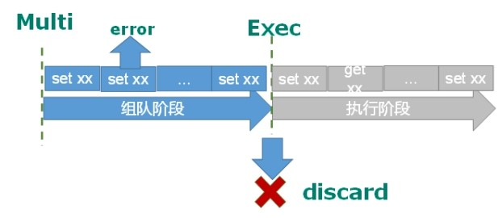
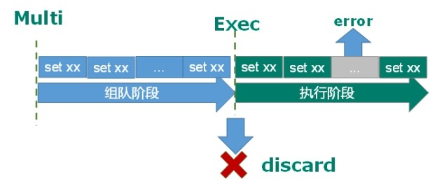
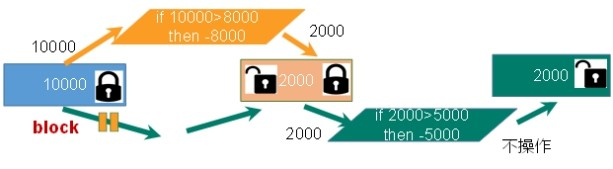
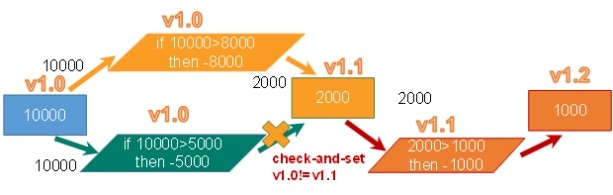
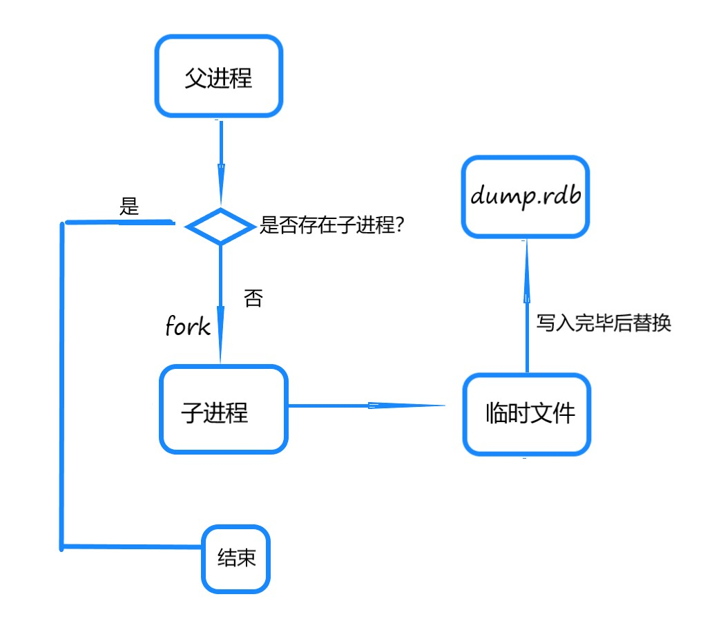
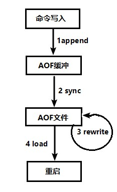
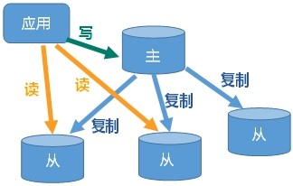
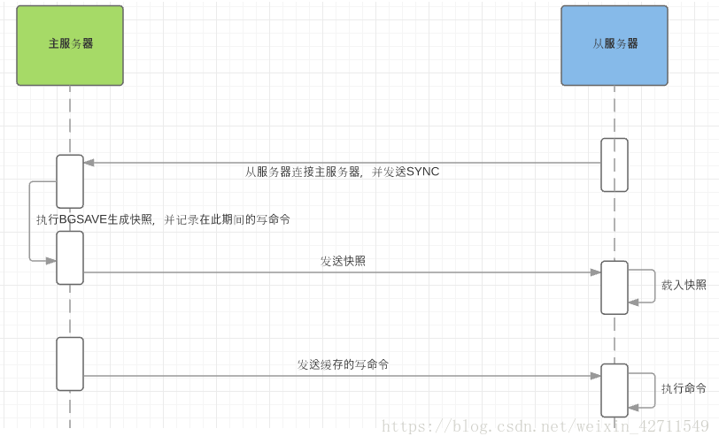
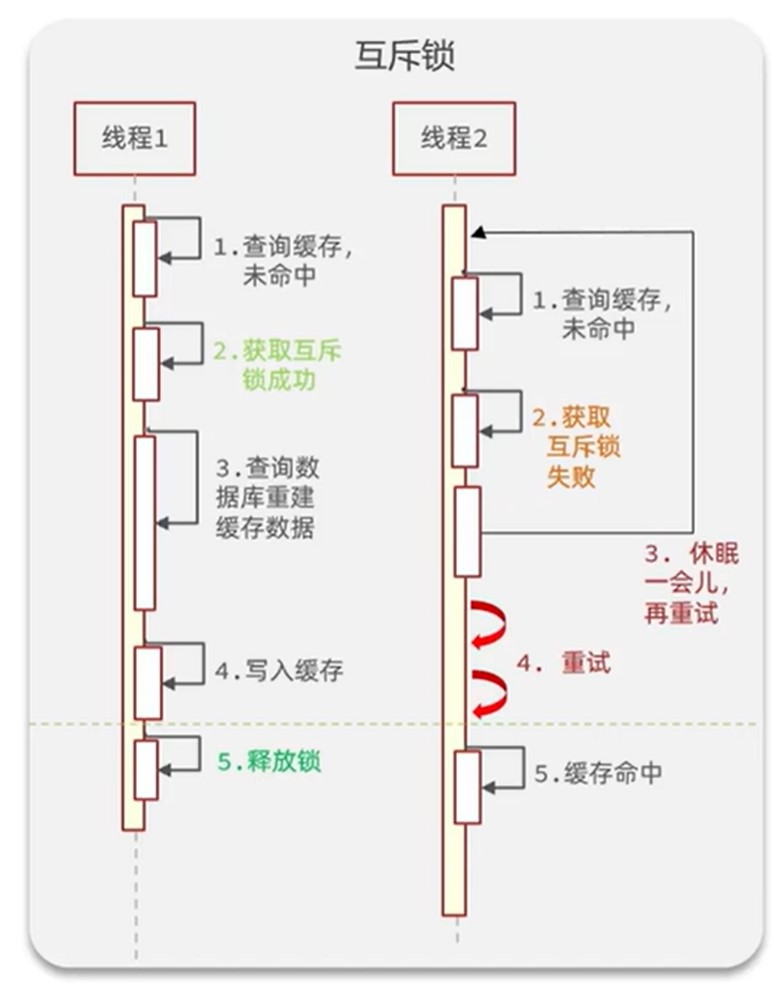
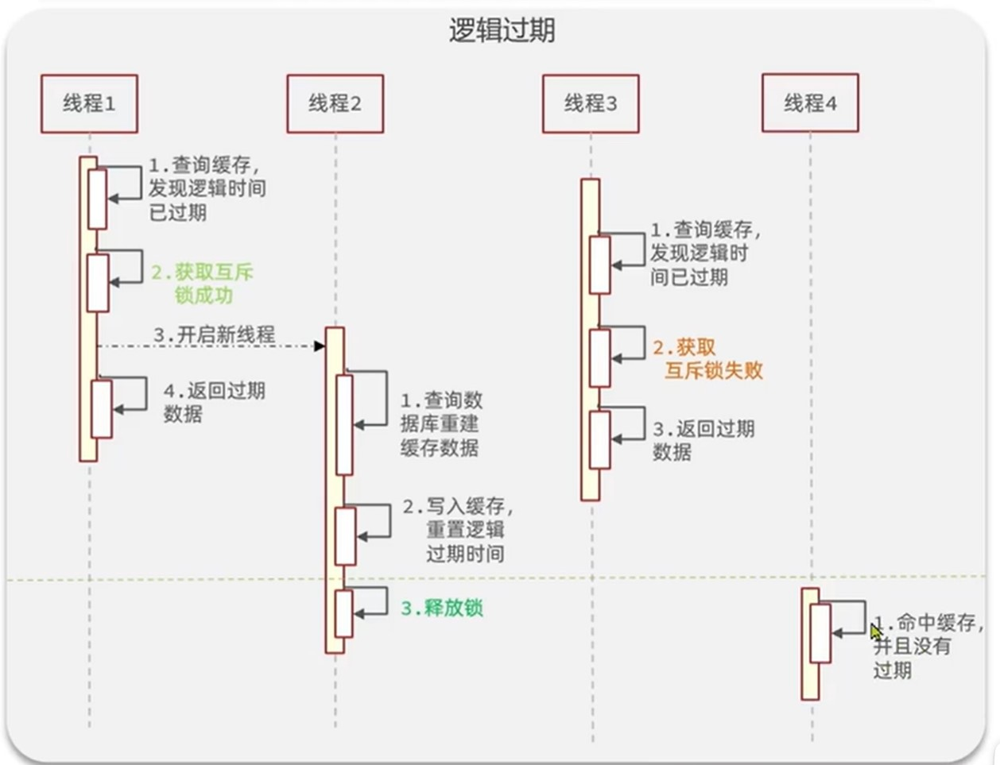

#Redis#
* 多种数据类型
* 支持持久化
* 单线程+多路IO复用

###常用命令
* keys *查看当前库所有key(匹配：keys *1)
* exists key判断某个key是否存在
* type key 查看你的key是什么类型
* del key       删除指定的key数据
* unlink key   根据value选择非阻塞删除 仅将keys从keyspace元数据中删除，真正的删除会在后续异步操作。
* expire key 10   10秒钟：为给定的key设置过期时间
* ttl key 查看还有多少秒过期，-1表示永不过期，-2表示已过期
* select命令切换数据库
* dbsize查看当前数据库的key的数量
* flushdb清空当前库
* flushall通杀全部库
###五大数据类型
####String  
底层：动态字符串  
value<=512M

* set   key value添加键值对
* get   key查询对应键值  
* append  key value将给定的value 追加到原值的末尾
* strlen  key获得值的长度
* setnx  key value只有在 key 不存在时设置 key 的值
* incr   key 将 key 中储存的数字值增1只能对数字值操作，如果为空，新增值为1
* decr   key 将 key 中储存的数字值减1只能对数字值操作，如果为空，新增值为-1
	* incrby / decrby  key 步长 将 key 中储存的数字值增减。自定义步长。
* mset  key1 value1 key2 value2  ..... 同时设置一个或多个 key-value对  
* mget  key1 key2 key3 .....同时获取一个或多个 value  
* msetnx key1 value1 key2 value2  ..... 同时设置一个或多个 key-value 对，当且仅当所有给定 key 都不存在。
* getrange  key 起始位置 结束位置 获得值的范围，类似java中的substring
* setrange  key 起始位置 value 用value覆写key所储存的字符串值，从起始位置开始(索引从0开始)。
* setex  key 过期时间 value 设置键值的同时，设置过期时间，单位秒。
* getset key value 以新换旧，设置了新值同时获得旧值。    

####List  
底层：  
数据少：分配一块连续内存空间——ziplist（压缩链表）  
数据多：以ziplist为节点构成的双向链表——quicklist

* lpush/rpush  key value1 value2 value3.... 从左边/右边插入一个或多个值。
* lpop/rpop  key从左边/右边吐出一个值。值在键在，值光键亡。
	* rpoplpush  key1 key2从key1列表右边吐出一个值，插到key2列表左边。
* lrange key start stop 按照索引下标获得元素(从左到右)
	* lrange mylist 0 -1   0左边第一个，-1右边第一个，（0-1表示获取所有）
* lindex key index 按照索引下标获得元素(从左到右)
* llen key 获得列表长度 
* linsert key before/after value newvalue 在value的前面/后面插入newvalue插入值
* lrem key n value 从左边删除n个value(从左到右)
* lset key index value 将列表key下标为index的值替换成value
####Set
底层：hash表，无序，排重  

* sadd key value1 value2..... 将一个或多个 member 元素加入到集合 key 中，已经存在的member 元素将被忽略
* smembers key 取出该集合的所有值。
* sismember key value 判断集合key是否为含有该<value>值，有1，没有0
* scard key返回该集合的元素个数。
* srem key value1 value2.... 删除集合中的某个元素。
* spop key 随机从该集合中吐出一个值。
* srandmember key n 随机从该集合中取出n个值。不会从集合中删除 。
* smove source destination value 把集合中一个值从一个集合移动到另一个集合
* sinter key1 key2 返回两个集合的交集元素。
* sunion key1 key2 返回两个集合的并集元素。
* sdiff key1 key2  返回两个集合的差集元素(key1中的，不包含key2中的)

####Hash  
类似Map<String,Object>的field——value映射表（便于存储对象）  
底层：  
数据少：ziplist  
数据多：hashtable

* hset key field value 给key集合中的field键赋值value
* hget key1 field 从key1集合field取出 value 
* hmset key1 field1 value1 field2 value2... 批量设置hash的值
* hexists key1 field 查看哈希表key中，给定域field是否存在。 
* hkeys key 列出该hash集合的所有field
* hvals key 列出该hash集合的所有value
* hincrby key field increment 为哈希表key中的域field的值加上增量 1   -1
* hsetnx key field value 将哈希表key中的域field的值设置为value，当且仅当域field不存在  
####Zset  
有序集合，每个成员关联一个score  
底层： hash+跳跃表  
hash：field——存放value，value——存放权重（score）  
跳跃表：根据hash中的value（即权重）排序  

* zadd key score1 value1 score2 value2… 将一个或多个 member 元素及其 score 值加入到有序集 key 当中。
* zrange key start stop [WITHSCORES]   返回有序集 key 中，下标在start stop之间的元素。带WITHSCORES，可以让分数一起和值返回到结果集。
* zrangebyscore key min max [withscores] [limit offset count]返回有序集 key 中，所有 score 值介于 min 和 max 之间(包括等于 min 或 max )的成员。有序集成员按 score 值递增(从小到大)次序排列。 
* zrevrangebyscore key max min [withscores] [limit offset count] 同上，改为从大到小排列
* zincrby key increment value 为元素的score加上增量
* zrem key value 删除该集合下，指定值的元素 
* zcount key min max 统计该集合，分数区间内的元素个数 
* zrank key value 返回该值在集合中的排名，从0开始。  

###发布和订阅  
订阅：一个客户端可以订阅多个频道  
`subscribe channel1`  
发布：客户端可以给频道发送消息，订阅该频道的客户端可以收到消息  
`publish channel1 hello`  
	
	//订阅该频道的客户端收到的消息
	1) "message"
	2) "channel1"
	3) "hellooooo"

######*springboot连接jedis
        Jedis jedis=new Jedis("192.168.147.128",6379);
        String s = jedis.ping();
        System.out.println(s);//PONG

###事务和锁机制
####事务
1.在组队阶段出现错误——整个事务回滚，不执行
  
2.在执行阶段出现错误——跳过错误，执行队列中其他
  
#####事务特性
* 单独的隔离操作  
事务中的所有命令都会序列化、按顺序地执行。事务在执行的过程中，不会被其他客户端发送来的命令请求所打断。 
* 没有隔离级别的概念  
队列中的命令没有提交之前都不会实际被执行，因为事务提交前任何指令都不会被实际执行
* 不保证原子性  
事务中如果有一条命令执行失败，其后的命令仍然会被执行，没有回滚

####锁
1.悲观锁
操作数据——>数据上锁（其他人无法操作）——>数据操作完毕——>开锁

2.乐观锁  
多人操作数据——>多人得到相同数据版本号——>一人完成数据操作——>数据版本号改变——>与其他人版本号不一致，无法完成操作
  

<td bgcolor=PowderBlue>存在库存遗留问题（LUA脚本解决）</td>  

###持久化

每次Redis重启，都会读取appendonly.aof或dump.rdb（appendonly.aof开启时默认读aof否则读dump.rdb）

####RDB

将当前Redis中的数据集以快照形式写入磁盘  

bgsave命令后：
  

* 手动触发：  
save：阻塞Redis服务，直到持久化完成  
bgsave：阻塞只发生在fork子进程的阶段，时间短  

* 自动触发（bgsave方式）  
redis.conf配置文件：

		save 3600 1    //3600s内有一个key变化
		save 300 100   //300s内有100个key变化
		save 60 10000  //60s内有10000个key变化

* rdb其他配置

`stop-writes-on-bgsave-error yes`当Redis无法写入磁盘的话，直接关掉Redis的写操作。  

`rdbcompression yes`   对于存储到磁盘中的快照采用LZF算法进行压缩。  

`rdbchecksum yes`  存储快照后，让redis使用CRC64算法来进行数据校验（会增加大约10%的性能消耗）

* dump.rdb检查  
/usr/local/bin下（安放redis-check-rdb的文件）执行`redis-check-rdb dump.rdb`

* 优劣
	* 优势  
大规模数据恢复  
	* 劣势  
写临时文件再替换——2倍膨胀性  
在最后一次持久化和服务器关闭之间的时间段对数据的修改无法被持久化  
####AOF
以日志的形式来记录每个写操作（增量保存），将Redis执行过的所有写指令记录下来(读操作不记录)保持在/usr/local/bin/appendonly.aof， 只许追加文件但不可以改写文件  

* 同步频率设置
	* appendfsync always  始终同步，每次Redis的写入都会立刻记入日志；性能较差但数据完整性比较好
	* appendfsync everysec  每秒同步，每秒记入日志一次，如果宕机，本秒的数据可能丢失。
	* appendfsync noredis  不主动进行同步，把同步时机交给操作系统。
* 持久化过程
	* 客户端的请求写命令会被append追加到AOF缓冲区内。
	* AOF缓冲区根据AOF持久化策略[always,everysec,no]将操作sync同步到磁盘的AOF文件中。
	* AOF文件大小超过重写策略或手动重写时，会对AOF文件rewrite重写，压缩AOF文件容量。
	* Redis服务重启时，会重新load加载AOF文件中的写操作达到数据恢复的目的。

* 重写机制  
把rdb 的快照，以二级制的形式附在新的aof头部，作为已有的历史数据，替换掉原来的流水账操作。
	* 手动触发`bgrewriteaof`
	* 自动触发（redis.conf配置）
		* `auto-aof-rewrite-percentage 100`文件大小到达重写基准值的100%（即两倍）后开始重写
		* `auto-aof-rewrite-min-size 64mb`
		* 系统载入时或者上次重写完毕时，Redis会记录此时aof大小，设为base_size,当aof大小>= base_size +base_size*100% (默认)且当前大小>=64mb(默认)的情况下，Redis会对AOF进行重写。
* appendaof.aof修复  
/usr/local/bin下（安放redis-check-aof的文件）执行`redis-check-aof--fix appendonly.aof`  

###主从复制
读写分离   容灾恢复  
  
`slaveof  <主服务器ip> <主服务器端口port>`成为某主服务器的从服务器

* 主从复制原理
 

* 一主二仆  
	* 从服务器宕机，重启后变为主服务器，重新slaveof后，从主服务器复制所有的数据
	* 主服务器宕机后，从服务器待命，不会变成主服务器  
* 薪火相传  
   
* 反客为主  
主服务器宕机后，其后的从服务器可以通过`slaveof no one`手动升级为主服务器
* 哨兵模式（自动的反客为主）
	* 配置
		* 进入sentinel.conf(`# sentinel monitor <master-name> <ip> <redis-port> <quorum>`已经从安装目录下拷贝到/etc)
		* 写入`sentinel monitor mymaster 127.0.0.1 6379 1`  mymaster——监视的主服务器名称，1——至少有1个哨兵同意迁移  
		* 执行`redis-sentinel  /xxx/sentinel.conf `（/usr/local/bin——redis-sentinel所在）
	* 过程  
		主服务器宕机  
		——>哨兵检测到宕机  
		——>哨兵在主服务器的所有从服务器中挑选一个作为新主服务器  
		——>哨兵向原主服务器的其他从服务器发送slaveof ...使其成为新主服务器的从服务器  
		——>原主服务器上线后，哨兵向其发送slaveof ... 使其成为新主服务器的从服务器  
	* 哨兵挑选机制  
		①优先级小 `replica-priority 100\\redis.conf中配置`  
		② 偏移量大（获得主服务器中数据全）  
		③runid小（每个redis实例启动后都会随机生成一个40位的runid）
###集群
* 启动N个redis节点，将整个数据库分布存储在这N个节点中，每个节点存储总数据的1/N。
	* 代理主机——应用向代理主机请求数据，代理主机向集群中存有应用所需数据的节点请求数据
	* 无中心化集群——用户向集群中的任意一个节点请求数据，该节点向集群中存储应用所需数据的节点请求数据
* 集群配置
	* `cluster-enabled yes`  开启集群
	* `cluster-config-file nodes-6379.conf`  集群配置文件
	* `cluster-node-timeout 15000`  节点失联时间，超过该时间（毫秒），集群自动进行主从切换
* 开启集群模式命令  
1.进入Redis安装目录的src下  
2.执行
`redis-cli --cluster create --cluster-replicas 1 192.168.11.101:6379 192.168.11.101:6380 192.168.11.101:6381 192.168.11.101:6389 192.168.11.101:6390 192.168.11.101:6391`
3.集群登录 `redis-cli -c -p xxxx（端口号）`

* slots  
一个集群16384个插槽，由集群中的节点分配处理，插入/取出一个key时，通过CRC16(key) % 16384 公式算出该key所在的插槽，再由当前节点重定向到处理该插槽的节点中进行插入/取出操作

* 故障恢复
	* 若集群中其中一台主服务器宕机，其从服务器成为主服务器，原主服务器重连后，成为现主服务器的从服务器
	* 若主服务器及其从服务器都宕机，根据redis.conf中 `cluster-require-full-coverage`来判断：yes——整个集群挂掉，no——宕机服务器负责处理的插槽不能使用

###应用
* 缓存穿透  
黑客在短时间内用一个不存在的key频繁查询，导致Redis的命中率降低，数据库压力增大
	* 解决
		* 对空值缓存：如果一个查询返回的数据为空（不管是数据是否不存在），我们仍然把这个空结果（null）进行缓存，设置空结果的过期时间会很短，最长不超过五分钟
		* 设置可访问的名单（白名单）：使用bitmaps类型定义一个可以访问的名单，名单id作为bitmaps的偏移量，每次访问和bitmap里面的id进行比较，如果访问id不在bitmaps里面，进行拦截，不允许访问。
		* 布隆过滤器（bitmap升级版）
		* 当发现Redis的命中率开始急速降低，需要排查访问对象和访问的数据，和运维人员配合，可以设置黑名单限制服务

* 缓存击穿  
对于一些热点数据，缓存中的key过期，高并发请求转发到数据库，导致数据库压力增大
	* 互斥锁
	 
	* 逻辑过期
	
* 缓存雪崩  
缓存在某一时刻有大量key过期，对这些key的请求全部转发至数据库，导致数据库压力增大