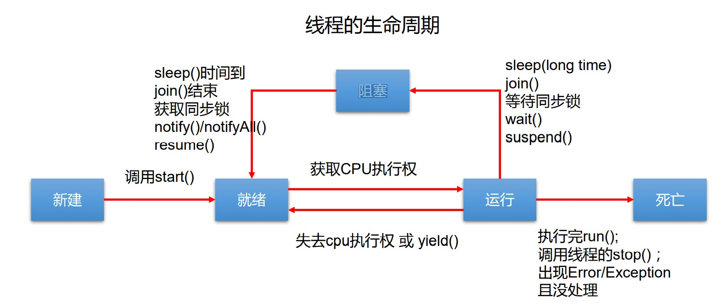

#Thread  
###创建线程方式  
1.1继承Thread类  

	//1. 创建一个继承于Thread类的子类
	public class MyThread extends Thread{  
	//2. 重写Thread类的run()
	    @Override
	    public void run() {
	        for(int i=0;i<100;i++){
	            System.out.println(Thread.currentThread().getName()+i);
	        }
	    }
	}

    public static void main(String[] args) {
        //3. 创建Thread类的子类的对象
        MyThread t1 = new MyThread();
        //4.通过此对象调用start():①启动当前线程 ② 调用当前线程的run()
        t1.start();
    }

1.2创建匿名子类

    public static void main(String[] args) {
        new Thread(){
            @Override
            public void run() {
                for (int i = 0; i < 100; i++) {
                    if(i % 2 == 0){
                        System.out.println(Thread.currentThread().getName() + ":" + i);
                    }
                }
            }
        }.start();

		//函数式
        (Thread) run()->{
            @Override
            public void run() {
                for (int i = 0; i < 100; i++) {
                    if(i % 2 == 0){
                        System.out.println(Thread.currentThread().getName() + ":" + i);
                    }
                }
            }
        }.start();

    }

2.实现Runnable接口  

	//1. 创建一个实现了Runnable接口的类
	class MThread implements Runnable{
	    //2. 实现类去实现Runnable中的抽象方法：run()
	    @Override
	    public void run() {
	        for (int i = 0; i < 100; i++) {
	            if(i % 2 == 0){
	                System.out.println(Thread.currentThread().getName() + ":" + i);
	            }
	        }
	    }
	}
    public static void main(String[] args) {
        //3. 创建实现类的对象
        MThread mThread = new MThread();
        //4. 将此对象作为参数传递到Thread类的构造器中，创建Thread类的对象
        Thread t1 = new Thread(mThread);
        t1.setName("线程1");
        //5. 通过Thread类的对象调用start():① 启动线程 ②调用当前线程的run()-->调用了Runnable类型的target的run()
        t1.start();

        //再启动一个线程，遍历100以内的偶数
        Thread t2 = new Thread(mThread);
        t2.setName("线程2");
        t2.start();
    }

Thread的run()调用Runnable的run()  

	private Runnable target;
	@Override
	public void run() {
	    if (target != null) {
	        target.run();
	    }
	}

---

###测试Thread中的常用方法：
 * start():启动当前线程；调用当前线程的run()
 * run(): 通常需要重写Thread类中的此方法，将创建的线程要执行的操作声明在此方法中
 * currentThread():静态方法，返回执行当前代码的线程
 * getName():获取当前线程的名字
 * setName():设置当前线程的名字
 *  yield():释放当前cpu的执行权 
 * join():在线程a中调用线程b的join(),此时线程a就进入阻塞状态，直到线程b完全执行完以后，线程a才结束阻塞状态。
 * stop():已过时。当执行此方法时，强制结束当前线程。
 * sleep(long millitime):让当前线程“睡眠”指定的millitime毫秒。在指定的millitime毫秒时间内，当前线程是阻塞状态。
 * isAlive():判断当前线程是否存活

###线程调度

同优先级：时间片策略——先进先出队列  
高优先级：抢占式策略——高优先级线程抢占cpu
#####优先级  
MAX\_PRIORITY：10  
MIN\_PRIORITY：1  
NORM\_PRIORITY：5  -->默认优先级  

`
	HelloThread h1 = new HelloThread("Thread：1");
	h1.setPriority(Thread.MAX_PRIORITY);`
###线程生命周期
 

###解决线程安全问题
* 同步代码块  （类似于Redis悲观锁）
	* 同步监视器——俗称：锁。任何一个类的对象，都可以充当锁。（要求：多个线程必须要共用同一把锁）
	* 需要被同步的代码——操作共享数据（多个线程共同操作的变量）的代码

			synchronized(同步监视器){
				//需要被同步的代码
			}

* 同步方法

		//非static方法——同步监视器为this（当前对象）
		private synchronized void function(){
			//需要被同步的代码
		}
		//static方法——同步监视器为xxx.class（当前类）
		private static synchronized void function(){
			//需要被同步的代码	
		}

* Lock锁  
手动启动和结束同步

		public class MyThread2 implements Runnable{
		    private Lock lock=new ReentrantLock();
		    @Override
		    public void run() {
		        try{
		            lock.lock();
		            //需要被同步的代码
		        }finally {
		            lock.unlock();
		        }
		    }
		}

* 单例懒汉式解决线程安全问题

		public class Bank {
		    private Bank(){}
		    private static Bank instance=null;
		    public static Bank getInstance(){
		        if(instance==null){
		            //此处阻塞会new多个对象
		            instance=new Bank();
		        }
		        return instance;
		    }
		}

解决：

	public class Bank {
	    private Bank(){}
	    private static Bank instance=null;
	    public static Bank getInstance(){
	        if(instance==null){
	            synchronized(Bank.class){
	                if(instance==null){
	                    instance=new Bank();
	                }
	            }
	        }
	        return instance;
	    }
	}

* 死锁（不同的线程分别占用对方需要的同步资源不放弃，都在等待对方放弃自己需要的同步资源，就形成了线程的死锁）

		public static void main(String[] args) {
        	StringBuffer s1 = new StringBuffer();
        	StringBuffer s2 = new StringBuffer();
        	new Thread(){
        	    @Override
        	    public void run() {
                	synchronized (s1){
                    	s1.append("a");
               	    	s2.append("1");
                    	try {
                        	Thread.sleep(100);
                    	} catch (InterruptedException e) {
                    	    e.printStackTrace();
                    	}
                    	synchronized (s2){
                        	s1.append("b");
                        	s2.append("2");
                    	}
                	}
            	}
        	}.start();
	        new Thread(new Runnable() {
	            @Override
	            public void run() {
	                synchronized (s2){
	                    s1.append("c");
	                    s2.append("3");
	                    try {
	                        Thread.sleep(100);
	                    } catch (InterruptedException e) {
	                        e.printStackTrace();
	                    }
	                    synchronized (s1){
	                        s1.append("d");
	                        s2.append("4");
	                    }
	                }
	            }
	        }).start();
    	}

###线程通信
 * wait():一旦执行此方法，当前线程就进入阻塞状态，并释放同步监视器。
 * notify():一旦执行此方法，就会唤醒被wait的一个线程。如果有多个线程被wait，就唤醒优先级高的那个。
 * notifyAll():一旦执行此方法，就会唤醒所有被wait的线程。
 * 三个方法是定义在java.lang.Object类中，调用者必须是同步代码块或同步方法中的同步监视器。