####canal介绍
####工作流程
canal伪装成mysql的一个slave，向mysql发送dump请求  
mysql将binlog日志推送给canal  
canal解析binlog，将其发送至rabbitMQ的指定交换机  
交换机将一个JSON格式的字符串发送给其绑定的队列  
队列将JSON字符串发送给canal-adapter  
canal-adapter根据配置好的mysql和elasticsearch的表的映射，将数据同步到es
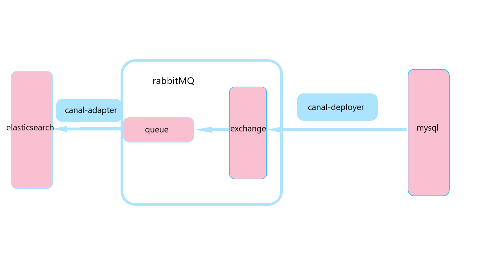

1. 开启mysql的binlog功能

		# my.conf的[mysqld]中写入
		[mysqld]
		log-bin=mysql-bin # 开启 binlog
		binlog-format=ROW # 选择 ROW 模式
		server_id=1 # 配置 MySQL replaction 需要定义，不要和 canal 的 slaveId 重复

2. 对canal账号赋予slave权限

		CREATE USER canal IDENTIFIED BY 'canal';  
		GRANT SELECT, REPLICATION SLAVE, REPLICATION CLIENT ON *.* TO 'canal'@'%';
		-- GRANT ALL PRIVILEGES ON *.* TO 'canal'@'%' ;
		FLUSH PRIVILEGES;
	若为mysql8以上版本，密码加密方式默认为`caching_sha2_password`，需将加密方式改为`mysql_native_password`

	`alter user 'canal'@'%' identified with mysql_native_password by '密码';`

3. 下载canal  
	[canal下载](https://github.com/alibaba/canal/releases)
	选择支持rabbitMQ的1.1.6版本的canal-deployer和canal-adapter
4. 配置canal-deployer
	1. 修改其目录中conf/example/instance.properties  
		数据库配置
		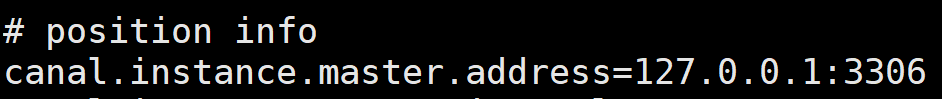
		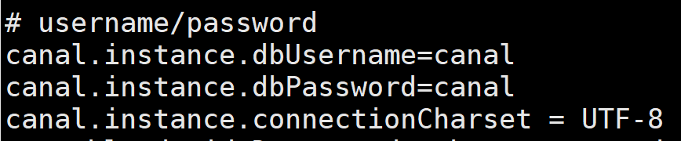
		需要同步的表
		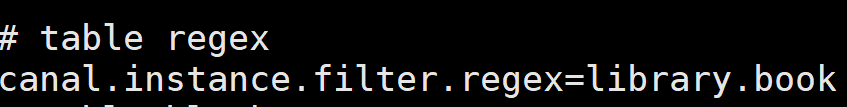
	2. 修改其目录中conf/canal.properties
		rabbitMQ配置
		
			配置rabbitMQ的host（不用加端口号）、虚拟路径、mq账号密码、交换机名
		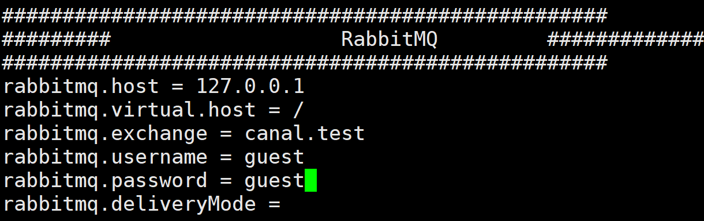
5. 在rabbitMQ中创建交换机并绑定队列 （交换机名字和队列的routing key同上配置所示） 
	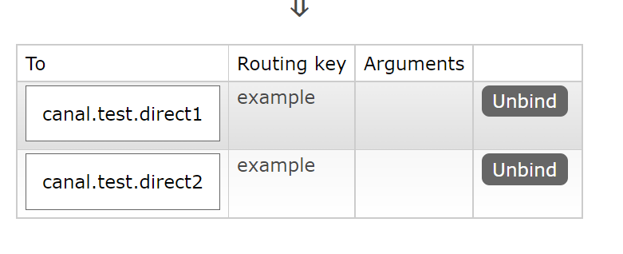  
往数据库中插入一条数据可看到消息传递到队列中，但未被消费  
	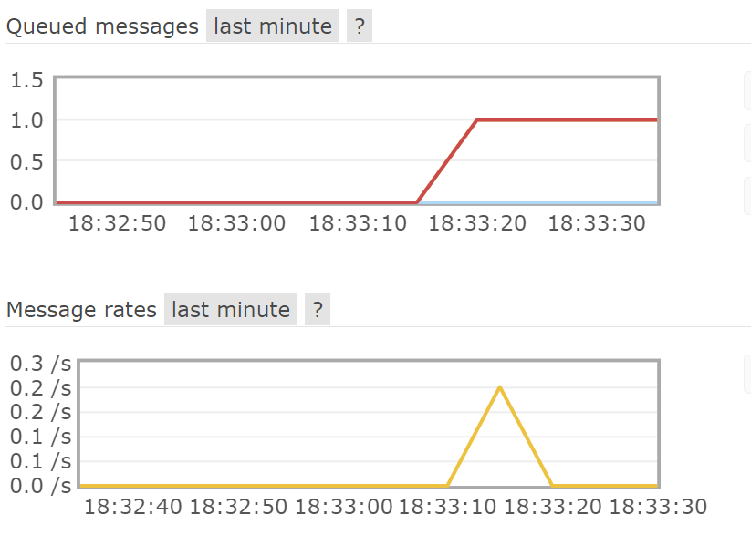
此时，已完成数据从mysql到rabbitMQ的传输
	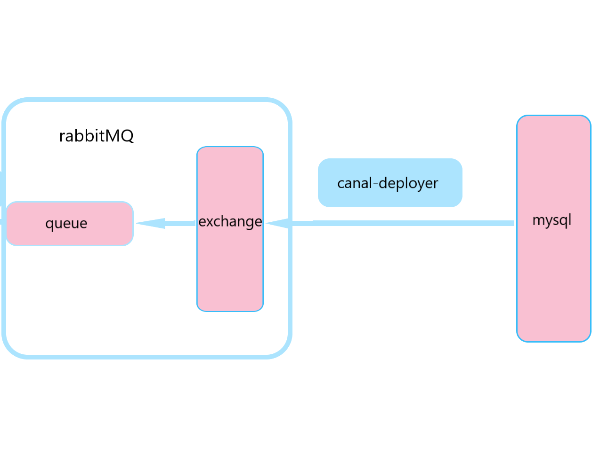
6. 配置canal-adapter  
	1. 删除其conf目录下的bootstrap.yml文件（该文件会自动去mysql中canal-manager数据库读取配置，而canal-manager的.sql文件在canal-admin中，本次我未下载canal-admin，故将该文件删去）
	2. 更改conf/application.yml  
		更改rabbitMQ配置
			
		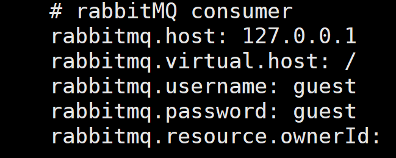
		从.yml文件下面的注释复制一个es的过来，改一下（-instance后面为canal-deployer配置的交换机中绑定队列的名称）
		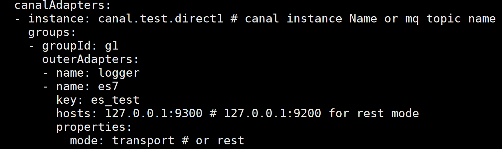
	3. 进入和aplication.yml的outerAdapters下和-name名字相同的目录（这里是es7）,配置mytest_user.yml，该.yml会在adapter启动时被扫描到  
		outerAdapterKey为上述application.yml的key，destination为队列的routing key  
		\_index为该表在es中索引名，\_id为表的主键
		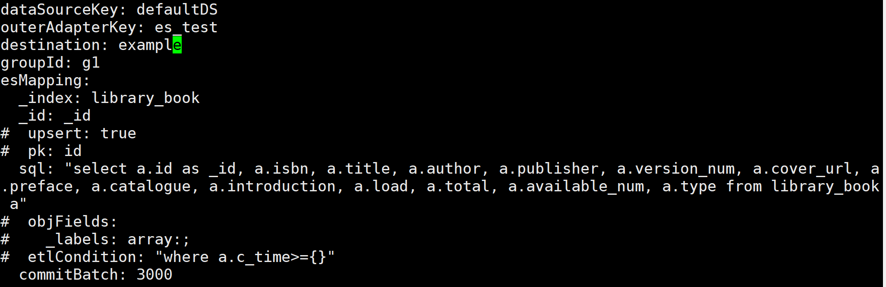
	4. 在bin目录下startup.sh脚本中更改内存，否则jvm可能会内存不够  
	
			if [ -n "$str" ]; then
			    JAVA_OPTS="-server -Xms256m -Xmx256m -Xmn256m -XX:SurvivorRatio=2 -XX:PermSize=96m -XX:MaxPermSize=256m -Xss256k -XX:-UseAdaptiveSizePolicy -XX:MaxTenuringThreshold=15 -XX:+DisableExplicitGC -XX:+UseConcMarkSweepGC -XX:+CMSParallelRemarkEnabled -XX:+UseCMSCompactAtFullCollection -XX:+UseFastAccessorMethods -XX:+UseCMSInitiatingOccupancyOnly -XX:+HeapDumpOnOutOfMemoryError"
			else
		    	JAVA_OPTS="-server -Xms256m -Xmx256m -XX:NewSize=256m -XX:MaxNewSize=256m -XX:MaxPermSize=128m "  
	开启adapter可以看到消息已经被消费  
	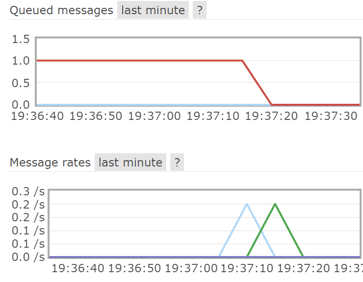
（注意事项1.删除bootstrap.yml，否则需要下载canal-admin 
2.canal-adapter配置为队列的名称 3..yml文件不能用tab键，否则报错 4.adapter的startup.sh脚本中改变内存，否则jvm虚拟机的内存会不够）