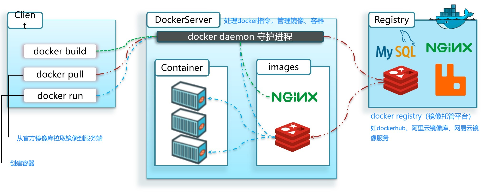
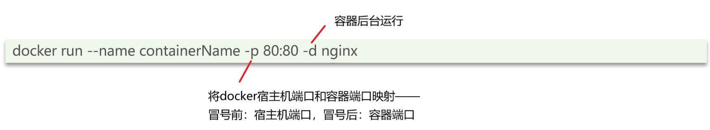
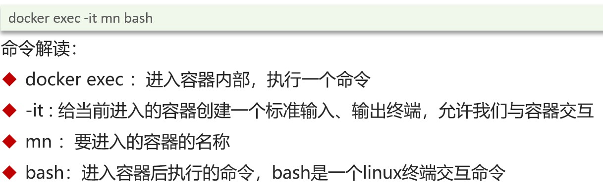
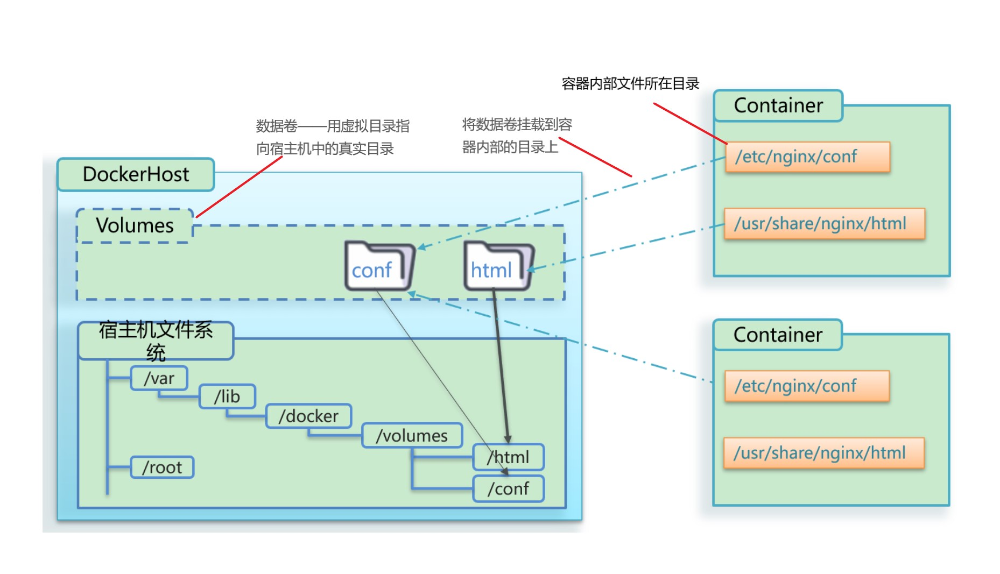
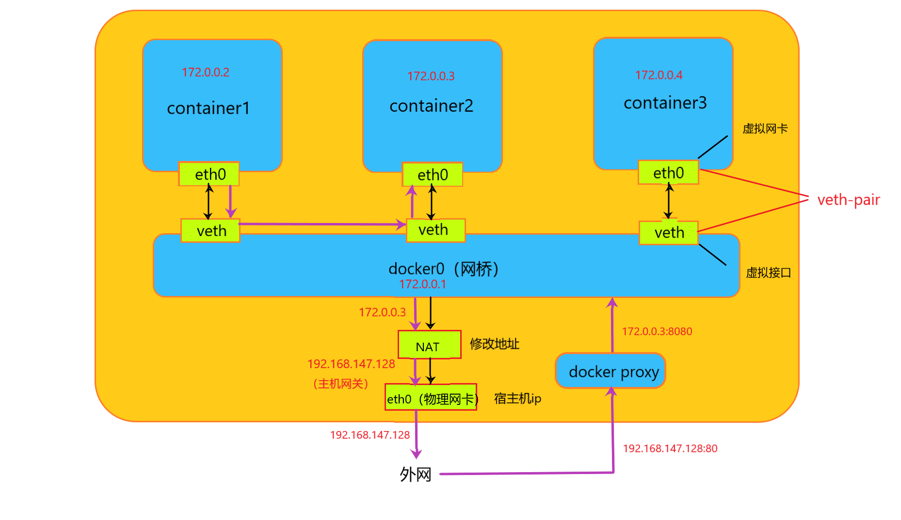

##Docker
####镜像（只读）
将应用程序（mysql、redis等）及其配置、依赖、函数库、运行环境等打包在一起  

* 联合文件系统  
	支持对文件系统的修改作为一次提交来一层层叠加。  
	一次加载多个文件系统各层叠加，外部只能看到一个文件系统  
* bootfs——包含bootloader（boot加载器）和kernel（内核），Linux启动时，bootloader将kernel解压加载到内存中，完成后bootloader被删掉。
* docker镜像技术使用宿主机的bootfs层，而封装rootfs层（包含系统中常见的目录和文件）
* 不同linux发行版本（如centos、ubuntu等）其bootfs基本相同，而rootfs层不同，镜像根据自身所需要的功能定制化封装，故可以极为精简，且可以将容器跑在与其版本不同的宿主机上（如centos的容器跑在ubuntu主机上）
####容器
镜像中的应用程序运行后形成进程，一个进程为一个容器，可创建多个容器，若需修改镜像中的文件（如mysql中的data文件），可将镜像中的文件复制至容器中修改，每个容器的文件互不干扰

#####容器命令
1. 创建容器
	
2. 进入容器
	

####数据卷
1. 数据卷挂载  
	`docker run --name mn -v html:/usr/share/nginx/html -p 80:80 -d nginx`  
	数据卷：容器内部目录
	

2. 目录直接挂载  
	`docker run --name mn -v /var/lib/docker/volumes/html:/usr/share/nginx/html -p 80:80 -d nginx`  
	宿主机目录：容器内部目录

####自定义镜像  
1. 将Dockerfile文件和.jar文件放入同一个目录下

		FROM java:8										 //以java8为基础镜像
		COPY ./demo01-0.0.1-SNAPSHOT.jar /tmp/compus.jar //拷贝宿主机上的文件到镜像指定目录
		EXPOSE 8888										 //暴露端口
		ENTRYPOINT java -jar /tmp/compus.jar			 //编写入口
2. 执行命令构建镜像`docker build -f ./Dockerfile -t 镜像名称:版本 .`
3. 创建容器`docker run --name c1 -v compus_certs:/usr/projects/compus/certs -v  compus_pictures:/usr/projects/compus/picture -p 8888:8888 -d compus:0.0.1`

####network  
1. bridge
