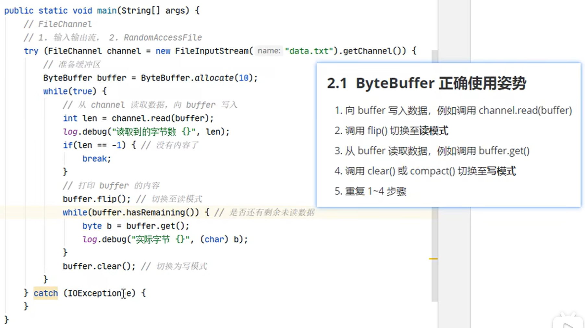

####IP
* IP地址分类方式1：IPV4 和 IPV6
	* IPV4：4个字节组成，4个0-255。大概42亿，30亿都在北美，亚洲4亿。2011年初已经用尽。以点分十进制表示，如192.168.0.1
	* IPV6：128位（16个字节），写成8个无符号整数，每个整数用四个十六进制位表示，数之间用冒号（：）分开，如：3ffe:3201:1401:1280:c8ff:fe4d:db39:1984
* IP地址分类方式2：公网地址(万维网使用)和私有地址(局域网使用)。192.168.开头的就是私有址址，范围即为192.168.0.0--192.168.255.255，专门为组织机构内部使用

####端口号
* 公认端口：0~1023。被预先定义的服务通信占用（如：HTTP占用端口80，FTP占用端口21，Telnet占用端口23）
* 注册端口：1024~49151。分配给用户进程或应用程序。（如：Tomcat占用端口8080，MySQL占用端3306，Oracle占用端口1521等）。
* 动态/私有端口：49152~65535。

端口号与IP地址的组合得出一个网络套接字：Socket。  

####传输层协议
* TCP协议：
    * 使用TCP协议前，须先建立TCP连接，形成传输数据通道
    * 传输前，采用“三次握手”方式，点对点通信，是可靠的
    * TCP协议进行通信的两个应用进程：客户端、服务端。
    * 在连接中可进行大数据量的传输
    * 传输完毕，需释放已建立的连接，效率低
    * ack——确认号，服务端收到的字节数+1
    * seq——序列号，客户端本次发送的第一个字节序列

* UDP协议：
    * 将数据、源、目的封装成数据包，不需要建立连接
    * 每个数据报的大小限制在64K内
    * 发送不管对方是否准备好，接收方收到也不确认，故是不可靠的
    * 可以广播发送
    * 发送数据结束时无需释放资源，开销小，速度快

###NIO
####三大组件
#####channel & buffer
* channel——读写数据的双向通道
* buffer——数据读写缓冲区
  * ByteBuffer
    
#####selector

