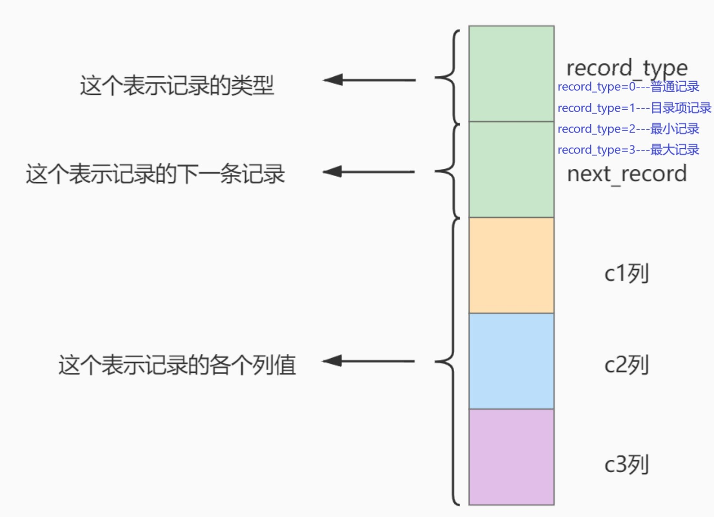
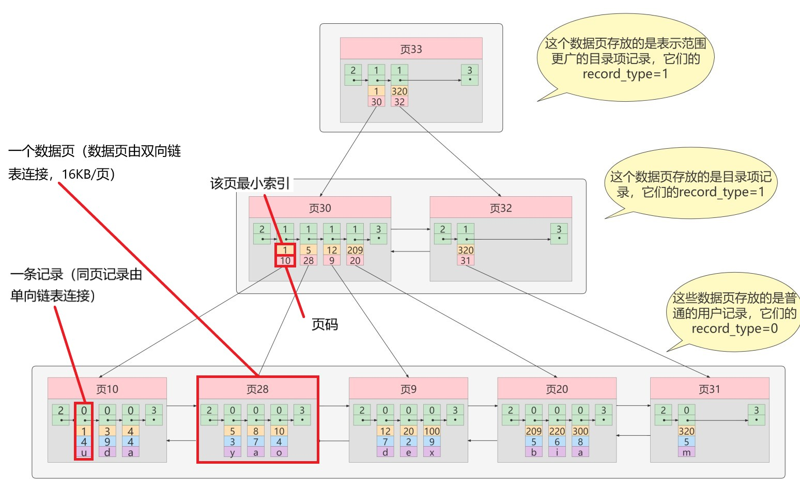
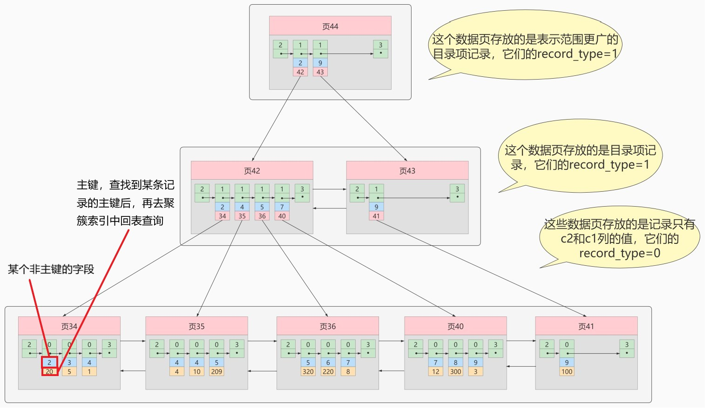
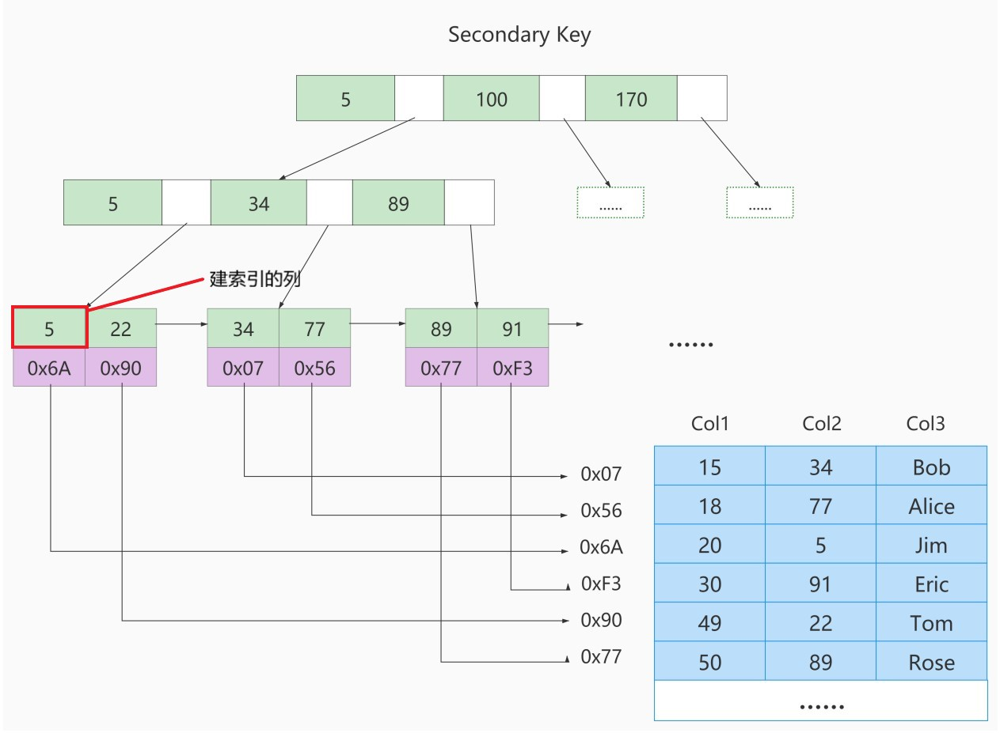
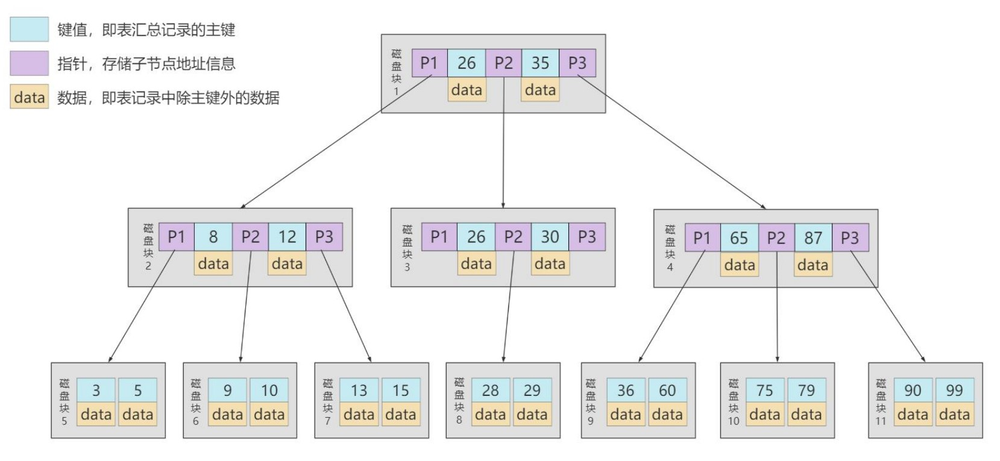
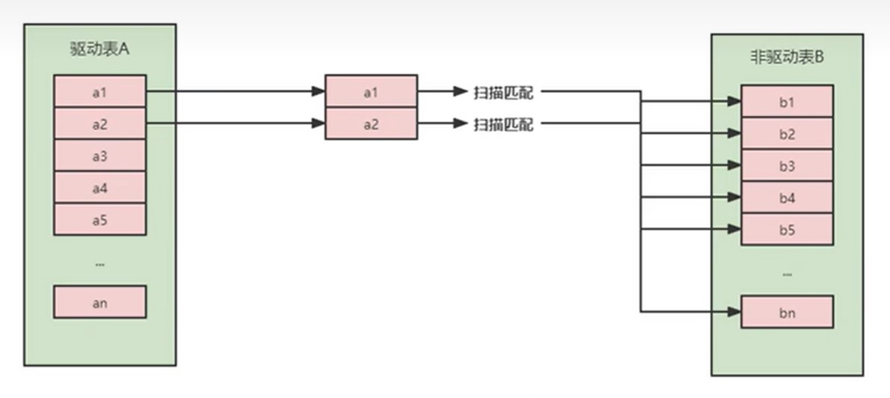
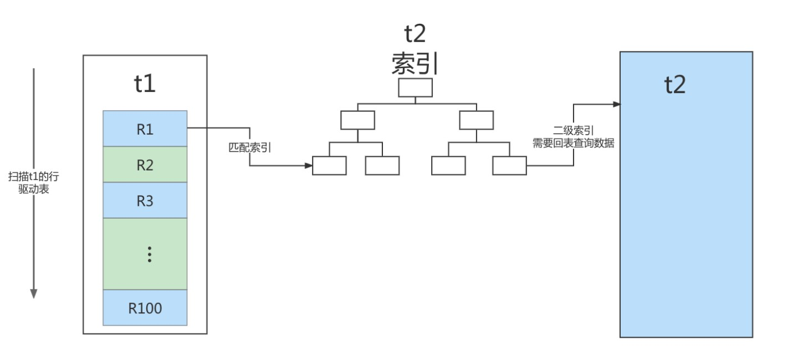
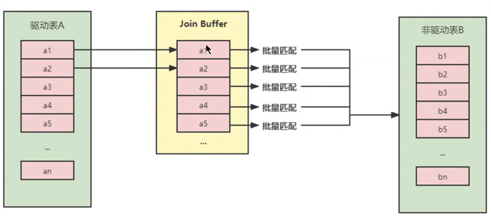

###索引
* 记录的行结构

* innodb索引结构——B+树   
	* 聚簇索引（Innodb存储引擎自动创建，无需调用显式的index语句）
	 
		* 使用记录主键值的大小进行记录和页的排序，这包括三个方面的含义：
			* 页内的记录是按照主键的大小顺序排成一个单向链表 。
			* 各个存放用户记录的页也是根据页中用户记录的主键大小顺序排成一个双向链表 。
			* 存放目录项记录的页分为不同的层次，在同一层次中的页也是根据页中目录项记录的主键大小顺序排成一个 双向链表 。
		* B+树的 叶子节点 存储的是完整的用户记录。
			* 所谓完整的用户记录，就是指这个记录中存储了所有列的值（包括隐藏列）。
		* 一表一个，一般为主键，若无，则为非空唯一索引，若无，则隐式地定义一个主键
	* 二级索引（非聚簇索引）
	  
		*  实际上目录项中每条记录为确保唯一都包含——（索引列的值+主键值）
		* 一个表可有多个
		* 增删改操作效率高于聚簇索引
		* 联合索引
			* 以多个列的大小为排序规则建立B+树
	* 一些特性
		* 根页面位置始终不变，若根页面存满，数据被复制到新页面中，根页面作为新页面的目录页（根页面始终为“最高等级的页”）
		* 一个页面最少存储2条记录

* MYISAM索引结构——B+树
	
	* 索引、数据分离（索引——.MYI文件，数据——.MYD文件）
	* 皆为非聚簇索引，data域存放一条记录的地址，要进行回表
	* 可以无主键

* 其他数据结构
	* Hash索引（类似HashMap，不支持范围查询、order by、模糊查询）
	* 二叉树（小于父节点放左边，大于等于父节点放右边）
	* 平衡二叉树
		* BF<=1（左子树高度-右子树高度）
		* 通过左旋右旋平衡左右高度
			* 左旋
				* 旧根节点为新根节点左子树
				* 若新根节点左子树存在，则为旧根节点右子树
				
			* 右旋
				* 旧根节点为新根节点右子树
				* 若新根节点右子树存在，则为旧根节点左子树
				
		* M叉树（M>2）
		* B树
		 

* 适合创建索引情况
	* 字段/联合字段唯一
	* 频繁作为where查询、插入、删除条件的字段
	* 经常order by和group by的列
	* distinct字段
	* join语句
	* 创建索引字段尽可能小
		* 使用类型小的字段创建
		* 使用字符串前缀——判断字符串重复度  
		`select count(distinct column) / count(*) from (table)`

* 索引失效
	* 全值匹配（where查询条件有多个，按顺序建立联合索引）
	* 最佳左前缀法则（where若要使用索引必须按照联合索引建立的顺序，若跳过某个字段，则索引后的字段均无法使用）
	* 计算、函数、类型转换导致索引失效
	* 联合索引向右匹配至范围条件后停止匹配——创建联合索引时把涉及范围的字段写在最后
	* 不等于（!=、<>）、is not null索引失效
	* 左模糊查询索引失效
	* or前后存在非索引的列
	* 不同字符集或索引失效

###JOIN查询底层

* 内连接——只有一张表有索引，则该表为被驱动表，若两张表都有或都无索引，则小结果集驱动大结果集
* Simple Nested-Loop Join
	
* Index Nested-Loop Join
	
* Block Nested-Loop Join
	
* index>block>simple