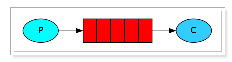

###Feign

###MQ
message queue——消息队列，实现异步通信  
  

* Broker：消息队列服务进程，此进程包括两个部分：Exchange和Queue  
* Exchange：消息队列交换机，按一定的规则将消息路由转发到某个队列，对消息进行过滤。
* Queue：消息队列，存储消息的队列，消息到达队列并转发给指定的customer
* Producer：消息生产者，即生产方客户端，生产方客户端将消息发送
* Consumer：消息消费者，即消费方客户端，接收MQ转发的消息。
####流程  
* 发送  
	producer和broker建立TCP连接  
	建立channel  
	建立队列  
	channel将消息发送给broker  
	exchange路由到指定queue
* 接收  
	consumer和broker建立TCP连接  
	建立channel  
	监听队列（若不存在则创建）  
	broker将consumer所监听的队列的消息发送给它  
	customer接收
####消息模型
1. 简单消息模型  
	 
2. 工作消息模型  
	 
3. 发布订阅模型
	* Fanout Exchange  
		
		将publisher的消息路由给所有绑定该Fanout Exchange的queue,再由queue发送给绑定该queue的consumer
	* Direct Exchange  
		
		将queue和exchange绑定时设置一至多个bindingkey  
		publisher向exchange发送消息时带上routingkey  
		exchange比对publisher发送的routingkey和queue的bindingkey，将消息发送至对应的queue
	* Topic Exchange  
		
		同Direct Exchange，但bindingkey采用通配符  
####mq延时队列的实现
1. 创建死信队列
2. 采用rabbitmq插件
	
###ES
* mysql、es比照
	
* 创建容器  

		docker run -d \
		--name es \
	    -e "ES_JAVA_OPTS=-Xms512m -Xmx512m" \
	    -e "discovery.type=single-node" \
	    -v es-data:/usr/share/elasticsearch/data \
	    -v es-plugins:/usr/share/elasticsearch/plugins \
	    --privileged \
	    --network es-net \
	    -p 9200:9200 \
	    -p 9300:9300 \
		elasticsearch:7.12.1
	- `-e "cluster.name=es-docker-cluster"`：设置集群名称
	- `-e "http.host=0.0.0.0"`：监听的地址，可以外网访问
	- `-e "ES_JAVA_OPTS=-Xms512m -Xmx512m"`：内存大小
	- `-e "discovery.type=single-node"`：非集群模式
	- `-v es-data:/usr/share/elasticsearch/data`：挂载逻辑卷，绑定es的数据目录
	- `-v es-logs:/usr/share/elasticsearch/logs`：挂载逻辑卷，绑定es的日志目录
	- `-v es-plugins:/usr/share/elasticsearch/plugins`：挂载逻辑卷，绑定es的插件目录
	- `--privileged`：授予逻辑卷访问权
	- `--network es-net` ：加入一个名为es-net的网络中
	- `-p 9200:9200`：端口映射配置
