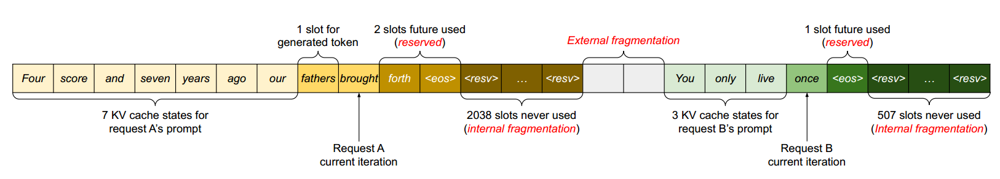
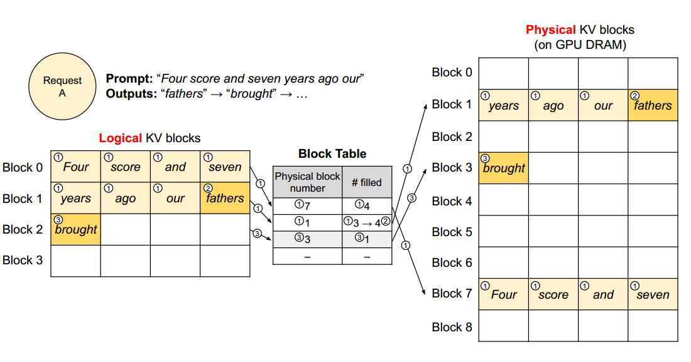
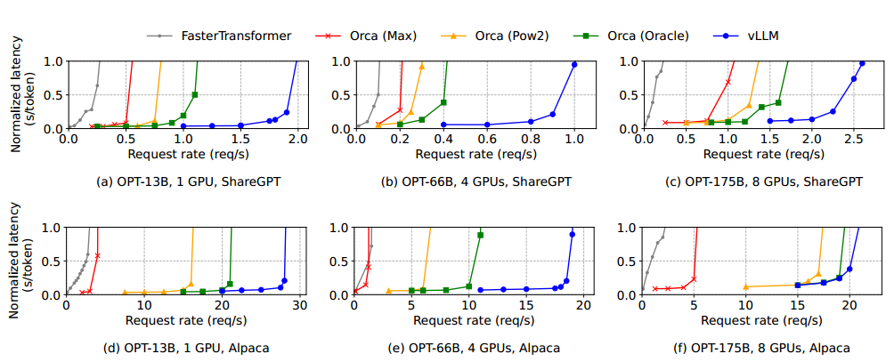

## 挑战

*   KV Cache的数量大

*   解码算法复杂（不同解密算法对KV Cache的共享程度不一致）

*   输入输出的长度不确定

*   浪费的三部分内存

    *   为未来生成tokens保留的slots
    *   预分配的空间大小大于实际生成序列KV Cache存储的空间大小导致的内部碎片
    *   以及来自内存分配器（如buddy分配器）的外部碎片

## 解决

### PagedAttention

将每个sequence的KV Cache划分为KV blocks,每个block包含固定数量tokens的KV向量（block可以不用连续存储）

### 不同应用

将一个请求的所有内存浪费限制在一个块内

*   当输入一个sequence生成多个output时：copy-on-write

    *   输入提示词阶段，所有输出的逻辑块直线统一的物理块
    *   为物理块新增标记reference count，表示引用该物理块的逻辑块
    *   当生成新的token时，若当前逻辑块映射的物理块还没用完，判断其reference count是否为1
    *   若不为1，将当前块复制一份，并减少reference count，逻辑块指向新的块

    将多输出的浪费降低到一个块内

*   当需要输出top-k个序列时：

*   共享前缀：将system prompt（系统提示符）和实际输入连起来作为请求许多请求共享一个前缀，可提前存储前缀的KV Cache

### 调度抢占

先来先服务调度策略，确保首先服务最早到达的请求，并首先抢占最新的请求

驱逐策略：序列的所有块都是一起被访问的，要么驱逐序列的所有块，要么不驱逐

*   swapping交换技术：将被驱逐的页面复制到磁盘上的交换空间，vLLM停止接收新请求，该序列请求完成后释放空间，被抢占序列从磁盘或CPU恢复继续处理，直到所有被抢占的序列都被完成，vLLM开始接收新请求
*   recomputation重新计算：被驱逐块的KV Cache不再保留，只保留目前生成的tokens

### 分布式（多块GPU）

[Megatron-LM](%E2%80%AA%E5%B9%B6%E8%A1%8C%E7%AD%96%E7%95%A5/megatron-lm.pdf)

GPU共享单个GPU缓存管理器，在每次解码迭代开始前，从管理器接收块表

## 实验结果

### 设置

#### 模型、服务器配置

*   具有13B、66B和175B参数的OPT
*   具有13B参数的LLaMA
*   谷歌云平台，带有NVIDIA A100 gpu的A2实例

#### 工作负载

ShareGPT和Alpaca数据集

#### Baseline

*   FasterTransformer

*   Orca

    *   Oracle——假设系统知道将为请求实际生成的输出的长度（？）
    *   Pow2——假设系统为输出预留了最多2倍的空间
    *   Max——假设系统总是保留空间到模型的最大序列长度

#### 关键指标

serving throughput服务吞吐量

normalized latency——每个请求的端到端延迟的平均值/其输出长度

*   共享前缀共享一次前缀时，vLLM的吞吐量比Orca （Oracle）高1.67倍此外，当共享更多的示例时， vLLM的吞吐量比Orca （Oracle）高3.58倍

*   Parallel Sampling and Beam Search

    *   Parallel Sampling
    *   Beam Search

    内存节省量，共享节省的块数/不共享的总块数
