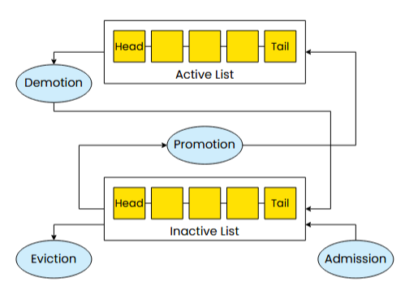

## 页面缓存（page cache）



当页面首次从存储中获取时，它会被添加到inactive list的尾部。如果该页面再次被访问，它会被提升到active list

当驱逐被触发时，页面将从inactive list的头部被移除

如有必要，页面缓存将通过将active list头部的页面降级到inactive list的尾部来平衡列表（在平衡期间，active list中已被引用的页面通常会被降级到inactive list，而不是像LRU或CLOCK算法那样给予在active list中的另一个机会。）

#### cgroup（control group）

一种用于控制进程资源使用的机制_每个 cgroup 代表一组进程，它可以被分配独立的资源配额（比如内存、CPU 等）

* 每个cgroup维护一个active list和一个inactive list
* 可以跨cgroup访问内存，但这种访问不会让该页面“归属”改变
* 这些按cgroup划分的list组成了整个页缓存

#### shadow entries

当一个页面 从 page cache 中被驱逐时，内核会为它保留一个小的“影子信息”条目，记录这个页面的关键访问元数据（例如：最近一次被访问的时间、所在文件的偏移等）；若该被驱逐的页面短时间内被再次使用，则将其放入active list——防抖动

## Design

### interface

#### Policy Function

**interface struct**：用来定义和暴露功能接口的结构体类型。内核中某个模块或子系统的功能以结构体成员**函数指针**（即方法）的形式组织起来，使得模块之间可以通过调用这些函数指针来完成交互和扩展

|       来源        |                     特点                     |                           举例                            |
| :---------------: | :------------------------------------------: | :-------------------------------------------------------: |
|   内核核心定义    |  作为整个内核或大型子系统标准接口，广泛使用  | `file_operations`, `net_device_ops`, `tcp_congestion_ops` |
| 模块/子系统自定义 | 针对特定模块或子系统的功能抽象接口，局部使用 |              自定义驱动接口、子系统扩展接口               |

example:

```c
struct device_ops {
    int (*init)(void *dev);
    int (*read)(void *dev, char *buf, size_t size);
    int (*write)(void *dev, const char *buf, size_t size);
    void (*shutdown)(void *dev);
};
```

一个设备驱动模块可能定义并实现这些函数，然后把指针填到这个结构体里，注册给内核。

```c
// 将设备驱动模块实现的函数的指针填到这个结构体里
static const struct device_ops mydev_ops = {
    .init = mydev_init,
    .read = mydev_read,
    .write = mydev_write,
    .shutdown = mydev_shutdown,
};
// 注册给内核
static struct device my_device = {
    .ops = &mydev_ops,
    // 其他初始化
};
```

内核就可以通过统一的接口调用这些操作

```c
void device_start(struct device *dev)
{
    if (dev->ops && dev->ops->init)
        dev->ops->init(dev);
}

ssize_t device_read(struct device *dev, char *buf, size_t size)
{
    if (dev->ops && dev->ops->read)
        return dev->ops->read(dev, buf, size);
    return -ENOSYS; // 函数不存在
}
```


**struct_ops**：Linux eBPF 子系统提供的一项功能，允许用户**用 eBPF程序**动态地替换interface struct的实现中的一些函数指针，以实现用户态对内核操作的自定义。类似于**@override**

目前 Linux 内核中只有**少数特定接口结构体**（interface struct）支持被 eBPF 程序通过 `struct_ops` 重写

具体实现：

* cachebpf 框架在内核中新增interface struct——**cachebpf_ops**
* 用户通过 `struct_ops` 实现这个结构体的函数指针，以定义自己的 **页缓存淘汰策略**，覆盖默认的策略

```c++
// Policy function hooks 
struct cachebpf_ops { 
    s32 (*policy_init)(struct mem_cgroup *memcg); 
    // Propose folios to evict 
    void (*evict_folios)(struct eviction_ctx *ctx, struct mem_cgroup *memcg); 
    void (*folio_added)(struct folio *folio); 
    void (*folio_accessed)(struct folio *folio); 
    // Folio was removed: clean up metadata 
    void (*folio_removed)(struct folio *folio); 
    char name[CACHEBPF_OPS_NAME_LEN]; };  

struct eviction_ctx { 
    u64 nr_candidates_requested; /* Input */ 
    u64 nr_candidates_proposed;  /* Output */ 
    struct folio *candidates[32]; 
};
```

#### Eviction List

Eviction list API，使用[kfunc](https://docs.ebpf.io/linux/concepts/kfuncs/)实现


#### Eviction Candidate Interface

迭代函数

```c
int list_iterate(
    struct mem_cgroup *memcg,					// 属于哪个cgroup
    u64 list,									// 要迭代的list
    s64 (*iter_fn)(int id, struct folio *f),	//回调函数，遍历时每经过一个node，list_iterate调用一次iter_fn，决定当前页是否被驱逐
    struct iter_opts *opts,						//选项，如何处理那些evaluated folios（遍历过程中，iter_fn已经被执行并对其作出处理判断的页）
    struct eviction_ctx *ctx					// 被选中驱逐的页被添加到ctx的candidate array中
);
```

### Isolation

 在一个cgroup中，进程具有相同的自定义驱逐策略，而在同一服务器上运行的不同cgroup可以各自使用自己的驱逐策略

### Memory Safety

 eBPF程序返回候选驱逐页面的array时，必须确保array中的指针有效

* 实现有效页面注册表：当一个页面进入缓存时，cachebpf将其添加到注册表，当一个页面被驱逐，cachebpf将其从注册表中删除
* 使用注册表验证每个候选驱逐页面是否有效
* 若 eBPF程序返回候选驱逐页面的array大小小于需要驱逐的页面数量，则退回默认策略
