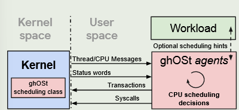
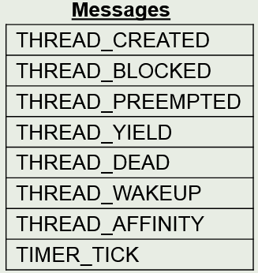

## overview

* ghOSt中每个CPU有一个本地agent，每个代理负责其自身CPU的线程调度决策
* 在集中式的情况下，一个全局代理负责对所有CPU进行调度。其他所有本地代理均处于非活动状态
* 每个代理都是在Linux pthread中实现的，所有代理都属于同一个用户空间进程

## Kernel-to-Agent Communication

内核将`native threads`的状态通过消息队列暴露给用户态的agents

#### ghOSt message

#### Message queues

`native threads`通过消息队列将消息传递给代理

#### Thread-to-queue association

`native threads`将消息传递给消息队列，线程和队列之间怎么关联？

每个在ghOSt下调度的线程被分配一个队列，所有关于该线程状态变化的消息都发送到该队列

* per-CPU model：每个线程被分配自身将要在上面运行的CPU的队列
* centralized model：每个线程统一都被分配全局队列

##### 映射关系的移动

agents使用系统调用**ASSOCIATE_QUEUE()**

#### Queue-to-agent association

消息队列将消息传递给agents，队列和agents之间怎么关联？

* per-CPU model：消息队列 >> 该队列所在CPU的本地agent，当向消息队列中产生消息时，内核唤醒agents
  * 唤醒机制：识别要唤醒的进程 >> 将其标记为可运行 >> 选择性地向目标CPU发送中断 >> 上下文切换到agent的线程
* centralized model：消息队列 >> 全局代理，无需唤醒代理，全局代理会轮询消息队列

#### 同步Kernel和agents

使用代理序列号`A_seq`和线程序列号`T_seq`

##### agents读取序列号的方式

`A_seq`和`T_seq`由内核负责维护和更新，但通过**共享内存**，以**状态字**的形式暴露给用户态 agent 读取

## Agent-to-Kernel Communication

agents收到内核的消息和状态字后，如何指示内核调度哪个线程？

#### 通过事务传送调度决策

* per-CPU model：每个 agent 只需要管理一个 CPU，发调度请求的频率不会特别高 >> 使用**系统调用接口**
* centralized model：一个 centralized agent 需要同时给 多个 CPU 发调度命令并接受其相应。若使用系统调用，每发一个请求都要陷入内核，开销大 >> 使用**共享内存接口**

##### commit transaction

（自定义API，底层是共享内存）

* TXN_CREATE()：agent在共享内存中打开一个新事务
* 写入要调度的线程的 TID 以及要在其上调度线程的 CPU 的 ID（per-CPU model中只调度agent自己的CPU）
* 事务写入完成后，通过 TXNS_COMMIT() 系统调用将其提交到内核

###### Group commits

一个agent通过将所有事务传递给TXNS_COMMIT()系统调用来提交多个事务，分摊系统调用的开销

通过批量中断，分摊发送中断的开销

###### 序列号使用（per-CPU）

面临问题：如果在 agent 还在运行调度逻辑的同时，新的消息（对应一个更高优先级的线程）被写入该 CPU 的消息队列。agent 提交当前事务后就让出 CPU，新的高优先级线程就错过了本该被立即调度的时机

解决：

* agent检查共享内存中的状态字获取`A_seq`，并从队列中读取消息
* 根据消息做出调度决策
* 将事务和之前获取的`A_seq`一起commit
* 若commit的`A_seq`比当前的`A_seq`旧（在commit之前，队列又向agent发送了新消息），则该事务被视为“过时”，失败并返回 ESTALE 错误
* agent清空其队列以检索更新的消息