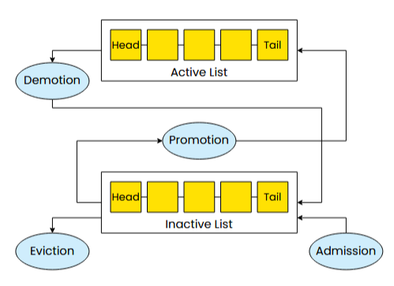

首先，在google和Meta的报告中都指出内存很昂贵

WSC：仓库级计算机，将一个完整的、可能包含数万台服务器的数据中心，视为一个单一的、巨大的、集成的计算系统

并且，各种类型的应用程序需要大量的内存

不同程序有不同的内存使用方式

图处理：稀疏且高度随机的访问（下一个要访问的顶点在内存中的位置与当前顶点的位置通常没有直接关系，导致大量的随机内存访问）；

ML模型：密集的、流式顺序访问（针对密集矩阵的线性代数运算——密集矩阵通常顺序存储，数据处理是流式——数据集被分成一个个批次，模型处理完一个批次，接着处理下一个，这个过程是连续的）；

Database：混合模式（随机访问——处理大量、简短、高并发的实时事务，顺序访问——对海量的历史数据执行分析查询）

为了减少内存消耗，数据中心的运营商使用了许多硬件架构

内存分层在DRAM内存下加了一层CXL连接的速度较慢但容量更大的拓展内存，通过将频繁访问的热数据迁移到DRAM，将不频繁访问的数据迁移到远程内存，扩大内存容量并降低硬件成本

内存分解将内存资源从计算服务器中物理分离，并通过高速网络将其汇集成一个共享资源池；服务器可以按需从远端的资源池中获取内存（解决单台服务器内存浪费或不足）

另一个是加速器的使用，用专门的硬件分担CPU在网络和存储I/O等任务上的负载——内存问题更加凸显

（ **Intel VT-d (Virtualization Technology for Directed I/O)** 等技术允许虚拟机直接访问硬件设备（如网卡），绕过hypervisor的软件模拟层，显著降低了I/O延迟）

而内存管理策略需要针对特定的硬件，和在硬件上运行的应用程序进行定制

所以，总体的问题是，当前的内存管理策略不足以应对以上说的多种硬件结构、多种应用程序的复杂情况

新的内存管理策略的开发需要涉及到大量的内核代码修改，赶不上环境的快速变化（难以跟上云计算、边缘计算、AI加速器等新兴计算环境的快速演进需求）

有一种叫做userfaultfd的机制，允许将page pault转发给用户态程序处理，以实现**自定义的内存管理策略**，但这样做的开销很大，每次page fault都要面临故障线程与处理线程间的IPC通信成本，在高并发场景下还面临串行化瓶颈问题

所以，这篇论文提出一个解决方案：它能够让定制不同的内存管理策略变得容易，同时，将它的开销维持在和在linux内核中的策略同一水平

这篇论文实现了ExtMem框架，它运行在用户态，允许用户在用户态实现自定义的内存管理策略

EXTMEM被设计为一个动态链接库，可以被动态地加载到应用程序地址空间中

ExtMem有三个组件

Core Layer：负责管理内存状态，并与内核交互

Observability Layer：负责收集用户自定义策略所需的数据

Policy Layer：向用户态提供API，以实现替换、预取等内存管理策略

​	页错误处理API：当应用程序发生页错误需要分配一个新页面时，从空闲DRAM列表中提供一个可用的物理页面

​	页面换入API：当应用程序访问一个已经被换出到磁盘的页面时，此函数被调用

​	页面跟踪API：当一个新页面被成功映射到内存后，将该页面交给策略进行管理

core layer：

Extmem为了让用户能在用户态实现自定义策略，必须将page fault事件从内核态传递到用户态

这一过程需要使用userfaultfd机制：

在应用程序调用mmap操作的时候，core layer拦截这些调用，将为其分配的内存区域注册到userfaultfd

（Core Layer 调用 `userfaultfd()`，从内核获取一个代表 `userfaultfd` 服务本身的文件描述符（`uffd`），Core Layer 接着使用这个 `uffd`，通过 `ioctl` 命令，将刚刚 `mmap` 的那块内存区域**注册**到这个服务中去）

当应用程序发生page fault时，若uffd检测出错误来自之前在mmap时，core layer注册到uffd的内存区域，则将错误转发给EXTMEM处理，再把内存管理决策权交给用户态

**（syscall_interupt、libc patching——LD_PRELOAD）**

（mmap——在调用进程的虚拟地址空间中创建一个新的内存映射

munmap——删除指定地址范围内的内存映射

madvise——向内核提供关于一块内存区域未来使用模式的建议或提示）

首先运行user fault endpoint，也就是一个新的处理page fault的线程

此时，user fault endpoint——也就是处理page fault的线程，（通过 `poll` 系统调用）监听userfaultfd的消息队列，等待新的page fault发生

而应用程序之前的mmap操作，只是在进程的**虚拟地址空间**中预留了一段连续的地址范围，**但没有为它分配任何实际的物理内存**

当应用程序对这块mmap分配的虚拟地址空间进行读写操作时，由于没有映射到物理地址空间，会发生page fault，应用程序由用户态转入内核态

内核将这次缺页的关键信息，如**故障地址**、是**读缺页还是写缺页**打包成一个msg，送入userfaultfd的消息队列中

然后阻塞应用程序进程

user fault endpoint(Handler thread)从消息队列中取出msg，对其进行处理

待其处理完毕，唤醒应用程序进程继续运行

faulting thread和handler thread构成IPC机制

一个 handler 线程处理所有缺页，在高并发下会成为瓶颈；若采用多个handler，userfaultfd只有一个消息队列，所有handler对其加锁读，无法发挥handler并发优势

而Extmem的page fault处理，对原本的uffd机制进行了改进

它取消了uffd中的等待队列和user fault endpoint这一用于处理page fault的用户态独立进程

同样的，在应用程序调用mmap操作的时候，core layer将其拦截下来，将为其分配的内存区域注册到userfaultfd，同时，还要为该线程注册一个upcall handler

每当应用程序触发page fault，该fault被转发到uffd

此时，uffd不再把错误信息送入等待队列中，而是向产生page fault的线程_faulting thread发送一个叫做SIGBUS的信号

当faulting thread即将从内核态返回用户态时，读取待处理队列中的SIGBUS信号

跳转到faulting thread之前注册的upcall handler

upcall handler会调用policy layerd API对该page fault进行处理

处理完返回应用程序继续执行

* page fault的故障地址

* MMU访问位和脏位

* Hardware Counter (硬件计数器) 
  * 位于 CPU 核心中的一组特殊寄存器。它们由一个称为 **PMU (Performance Monitoring Unit, 性能监控单元)** 的硬件子系统管理
  * Observability Layer 会**定期地**读取 PMU 中这些计数器的值（执行了多少条指令、发生了多少次缓存未命中 (Cache Misses)、内存带宽的使用情况等）

关于ExtMem的性能评估，列出了四个问题（这里主要说明第一个和第四个）

首先，是否ExtMem实现的upcall机制比userfaultfd要好？

使用单个线程持续访问新分配的内存区域中的页面，记录解决单个page fault的平均延迟（当页面在内存中但未映射到进程页表中时，会出现minor page fault，衡量缺页处理机制本身的路径长短和开销）

由于usefaultfd故障处理路径中的往返IPC，ExtMem的延迟明显比userfaultfd的延迟低

接着，使用不同数量的线程持续访问新分配的内存区域中的页面，记录在多线程并发环境下解决单个page fault的平均延迟

由于userfaultfd的待处理队列的读取需要上锁，不能进行并发的读取，发现随着线程数量的增多，ExtMem的延迟明显低于userfaultfd，且差距越来越大

第二个要说明的问题是，ExtMem是否能改善应用程序的性能？

论文运行了一个大规模的图处理程序PageRank

* 计算图中每个顶点重要性——反复迭代，根据邻居节点的值来更新每个节点自身的Rank值，直到所有节点的Rank值收敛稳定
* 当一个顶点被访问时，其相邻顶点档大概率被访问

它由顶点数组和边数组两个数组组成

顶点数组：当前index顶点指向边数组中 该顶点自身的邻居顶点列表 的起始位置

边数组：按index存放每个顶点的邻居顶点列表

将内存限制在总图大小的50%

使用与Linux（EXTMEM-2QLRU）几乎相同的算法的EXTMEM会产生适度的改进

* 测试内存压力下的综合性能，除了上述缺页处理机制本身的路径长短和开销，还要考虑页面载入和驱逐问题：当需要的页面不在内存中，必须从磁盘上加载回来，当内存满了，要将页面从内存中驱逐到磁盘空间（handler的部分）

* 而应用程序专属的handler相比于linux为所有应用程序设计的通用handler更快

  * linux handler：不能因为一个程序需要内存，就粗暴地换出另一个重要程序的页面。它必须在所有进程之间做出权衡

    （包含了大量的检查和复杂的逻辑分支：遍历全局的LRU、这个页面属于哪个进程？这个进程是不是已经换出了很多页？——为了公平，不能总从同一个“老实”进程里抢页面）

  * ExtMem：只需要考虑当前这一个应用程序的内存需求，不需要在多个进程间寻求公平

    （从自己的LRU 链表的末尾取出一个页面）

但当我们部署自定义算法（EXTMEM-PR）时，我们获得了超过2倍的加速

EXTMEM-PR

**2Q-LRU**

