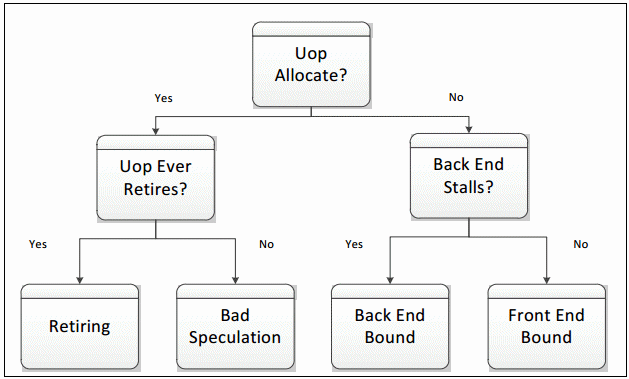
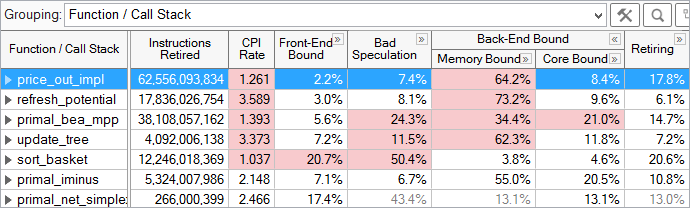

# 自顶向下的微架构分析方法

### CPU的流水线

**前端（front-end）**：获取以体系结构指令表示的程序代码，并将其解码为一个或多个低级硬件操作 ，这被称为micro-ops(uOps)，然后在一个名为分配（allocation）的过程中，uOps被输送到后端。前端每个周期可以分配4个uOps

**后端（back end）**：监控uOp的操作数（data operand）何时可用，并在可用的执行单元中执行uOp。 当uOp的执行完成后，我们把它称作执行完成（**retirement**），并且 uOp的结果会被提交到CPU寄存器或写回内存。后端每个周期可以执行完成4个uOps

**pipeline slots**：CPU核心中处理一个微操作所需的硬件资源

**停滞（stall）**：一个槽位在一个时钟周期内是空的

### pipeline slots的四分类

* slots被uOp填充
  * uOp最终执行完成——retiring
  * 未完成——Bad Speculation
* slots为空
  * 停滞是由于前端无法用uOp填充槽造成的——Frontend Bound前端绑定槽
  * 前端已准备好uOp，但由于后端尚未准备好处理它而因此无法交付它——Backend bound后端绑定槽

### top-down-method for analysis (TMA)

收集以上四分类事件

